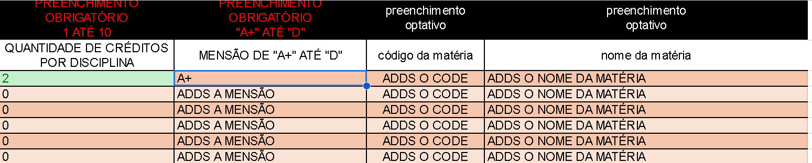
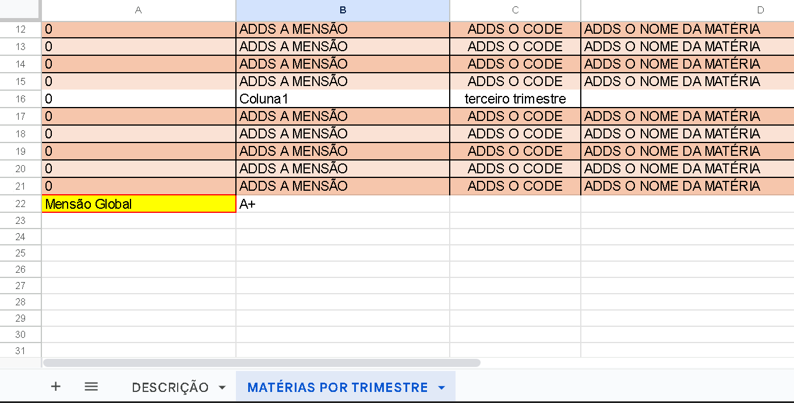
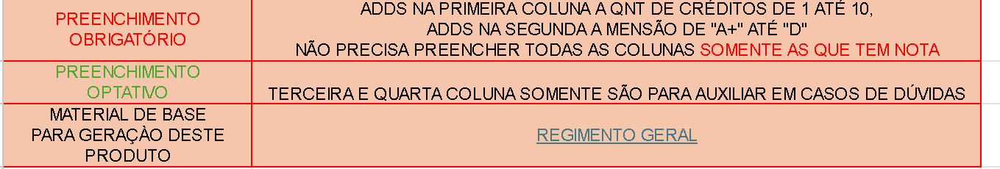
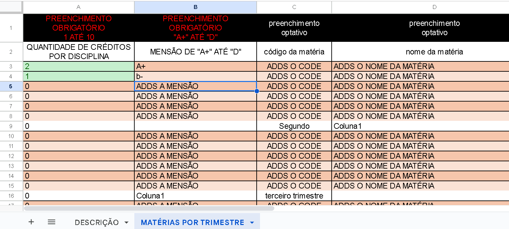
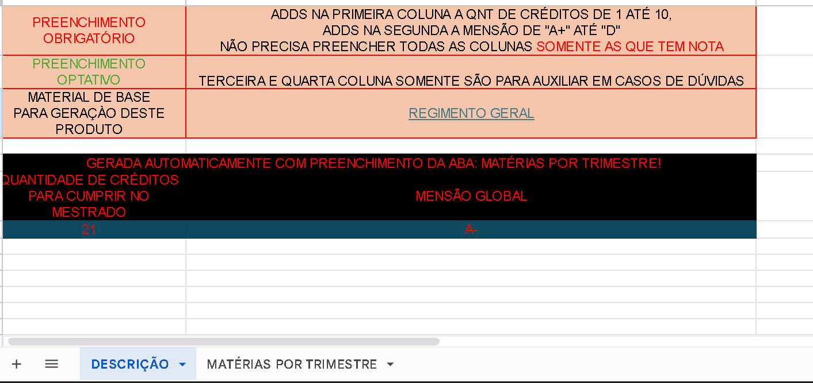

# NOTAS-INPE

**OBJETIVO PRINCIPAL É CRIAR UM ARQUIVO DE PLANILHA PARA PODER CALCULAR AS NOTAS DAS MATÉRIAS**

- NA VERSÃO ATUAL EXISTE UMA PASTA QUE SE CHAMA: V_01 COM A PLANILHA DO [EXCEL](V_01/MODELO_DE_PLANILHA_NOTAS_INPE_MESTRADO_DANIEL_FARKATV1.0.xlsx) E A MESMA PODE SER VISTA NO [GOOGLE SHEETS](https://docs.google.com/spreadsheets/d/1JC8rRvmfI_AnBJ6aGWLjp92_lxnswQU4nCeEfIbexVE/edit?usp=sharing).

## EXEMPLO DE NOTAS

- Neste exemplo é adicionada uma matéria de dois créditos no qual o aluno tirou nota A+

- Ao final desta aba chamada _MATÉRIAS POR TRIMESTRE_ esta a mensão global até o momento na linha 22

- NA tabela descrição há uma breve descrição do que é **OBRIGATÓRIO** preencher e o que é **OPTATIVO** de preencher. assim como o [regimento interno](https://www.gov.br/inpe/pt-br/area-conhecimento/posgraduacao/regimentos) que serviu de base para este produto

- No final da aba descrição existe uma tabela gerada automaticamente informando quantos créditos faltam para finalizar os obrigatórios e a mensão global

- Portanto, conforme forem adicionados novos dados na aba _Matérias por trimestre_ a tabela do canto inferior da aba descrição será alterada

